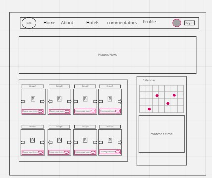
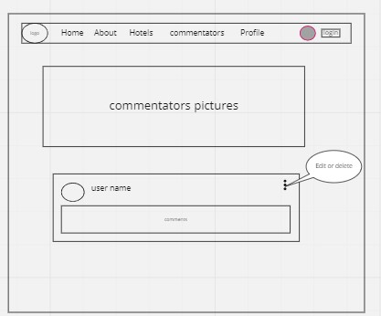
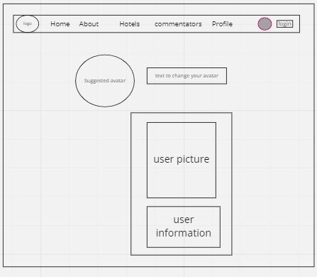

# World_Cup_Application

**Author**: 
* Walaa' Atiyh
* Amani M ALZoubi
* Omar Darweesh
* Bayan Bushnaq
* Osama Elddadow
* Omar Ali
* Razan Alowedat

**Version**: 1.0.0 (increment the patch/fix version number if you make more commits past your first submission)

## Architecture
**wireframe for the home page:**

**wireframe for the comment page:**

**wireframe for the profile page**

## Overview
<!-- Provide a high level overview of what this application is and why you are building it, beyond the fact that it's an assignment for this class. (i.e. What's your problem domain?) -->

## Getting Started
<!-- What are the steps that a user must take in order to build this app on their own machine and get it running? -->

## Architecture
* This Web Application is built on React ,Bootstrap and authentication process for the sake of the front-end design along side CSS.
* Axios library was used to ease the process of making a GET ,Add,Delete,and Update requests.
* Dicebears API allows to provide customized avatars for the users.
*  Country Flag API  The user can know the groups and the teams in it
* API
* API
* React-Calender-library  to git  alive calender .
* Netlify was used to deploy the final product.

## Change Log
09-09-2022 12:00pm - Create the initial template for the application. -->
11-9-2022 -creat React -calender &card that show the competition groups & the user can add , update,delete comment

## Credit and Collaborations
<!-- Give credit (and a link) to other people or resources that helped you build this application. -->
[start codefellow](https://github.com/codefellows/can-of-books-backend-template)

[Walaa' Atiyh](https://github.com/WalaaAtiah)

[Amani M ALZoubi](https://github.com/amani51)

[Omar Darweesh](https://github.com/dee-desu)

[Bayan Bushnaq](https://github.com/BayanBushnaq)

[Osama Elddadow](https://github.com/osamadado123)

[ Omar Ali](https://github.com/omarali1997)

[Razan Alowedat](https://github.com/Razan-abdullah)

